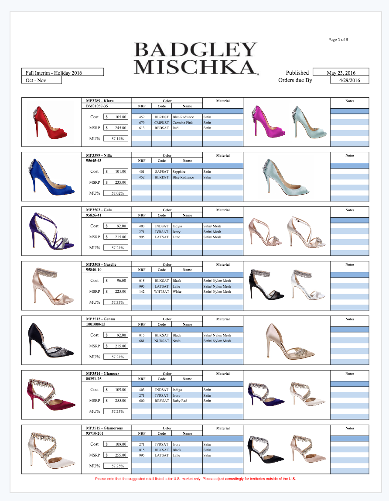
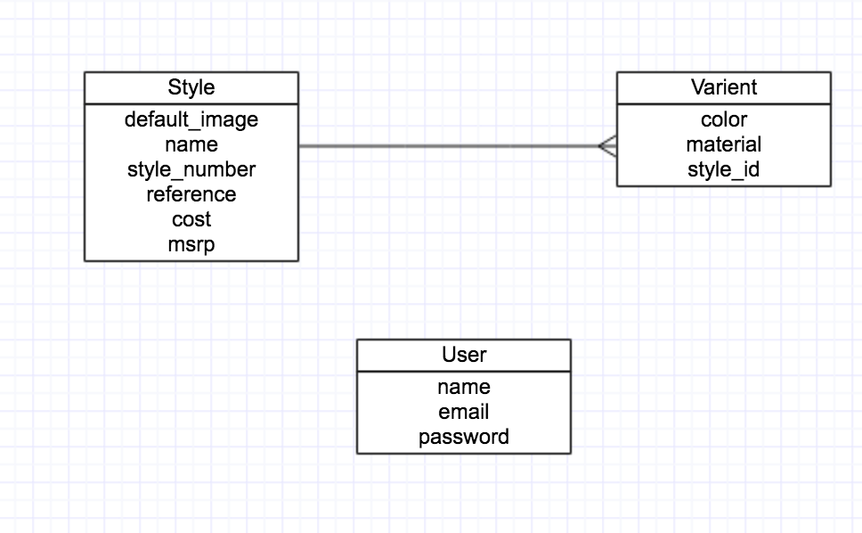
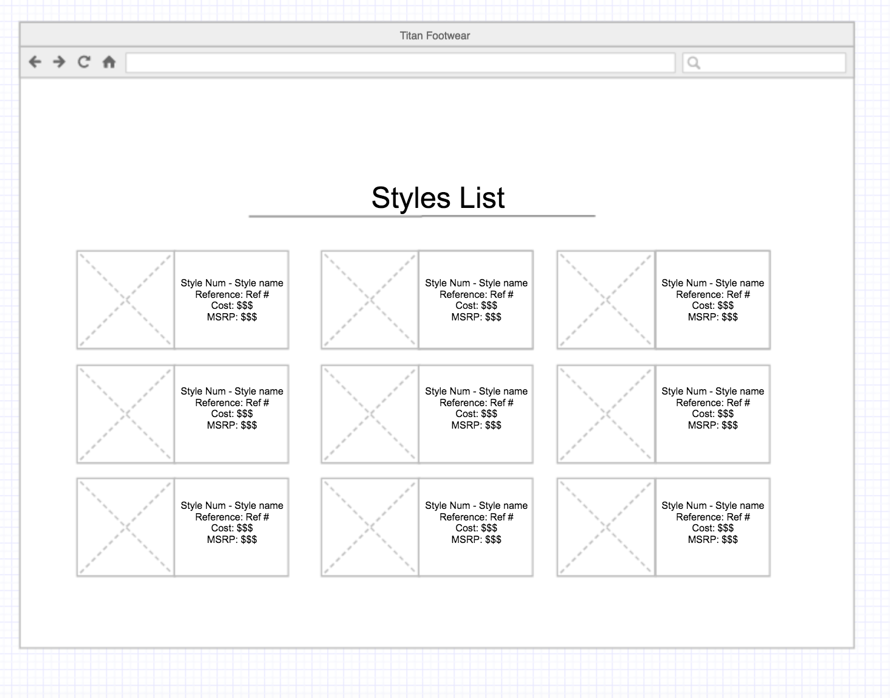

**Titan Linesheet builder**

Titan industries was in need of an application where its sales personel would be able to log in to the site and simply construct basic line sheets/ catalogues for it's customers

This app took the companies basic structure built in excel 

and transfered to the web!

Users can log in and add desired styles with cost and MSRP and then even add multiple colors and materials to those created styles. 

**User Stories**

* As a user, I want to create a style with name, style reference, cost and MSRP
* As a user, I want to edit a style I create
* As a user, I want to see all styles ive created
* As a user, I want to add mulitple colors and pictures for each style
* As a user, I want to be able to delete a style I've created

**ERD Diagram** 

**Style List View**

**Technologies/Frameworks**

* Ruby
* Ruby on Rails
* JavaScript
* HTML
* CSS
* Bootstrap
* PostgreSql

**Future Implementation**

* Have index pages by Footwear brand
* Have seperate index pages for each collections season
* Be able to select "favorite" styles and autocompile a new list view based on favorites 
* Have a search function
* Clean up some styling issues and make it more visably functional and pleasing

**Check Out The App**

[Link to App](https://tranquil-tor-22942.herokuapp.com)

